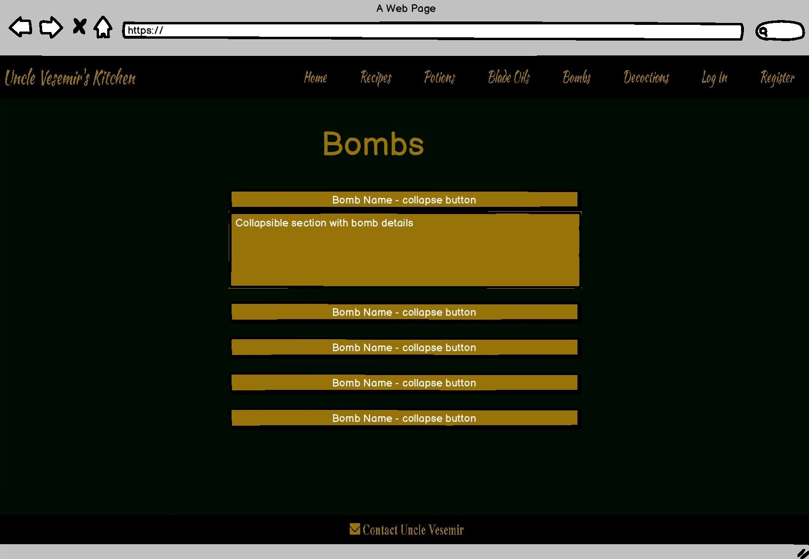
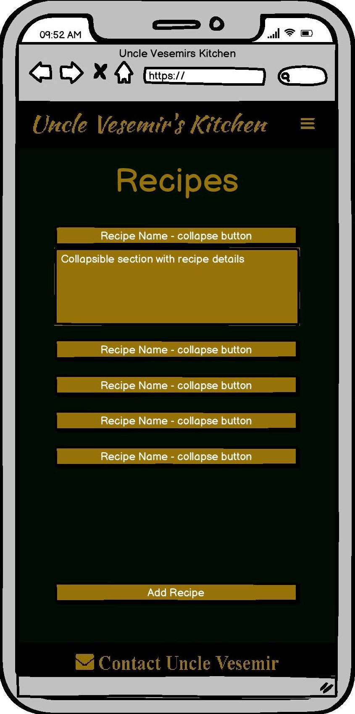

# Milestone Project 2 - Uncle Vesemirs Kitchen
This website is for submission as my third milestone project. 
The goal of this site is to provide fans of The Witcher universe with various different recipes for use in real life and in The Witcher 3: Wild Hunt video game.

## UX

### Design

Website design was initially planned using the following wireframes which I created using the Balsamiq software:
 
#### Desktop

* .
* .
* .
* .
* .
* .
* .
* .
* .
* .
* .
 

#### Tablet

* .
* .
* .
* .
* .
* .
* .
* .
* .
* .
* .
 

#### Mobile

* .
* .
* .
* .
* .
* .
* .
* .
* .
* .
* .

#### Database Diagram

* .
 

Wireframes available as pdf here:

* [Desktop](wireframes/desktop-wireframes.pdf).
* [Talbet](wireframes/tablet-wireframes.pdf).
* [Mobile](wireframes/mobile-wireframes.pdf).

Database Diagram available as pdf here:
* [Database Diagram](wireframes/DatabaseDiagram.pdf).

### User Stories

#### User 1 - The Witcher Book Collection Fan
I've read all the books and find myself drooling by the end of most chapters! I need to bring the smells and tastes of Novigard to my home (and my belly).

#### User 2 - The Witcher 3: Wild Hunt Player 
While trying to complete a quest in game, I keep dying from drowning! I want to know what potions are available to me so I can pass this quest.

#### User 3 - The Witcher 3: Wild Hunt Player 
As a fan of the art styling of the video game, I like to explore the vast open world, however a monster in the wild seems to always hunt me down. I need to know what will make my sword more useful in this fight for my life!

#### User 4 - The Witcher 3: Wild Hunt Player
I keep getting all these monster body parts when collecting my trophy. I need somewhere to tell me what I need to add to these to make the 'decotations' the game informs me can be made from these body parts.

#### User 5 - The Witcher 3: Wild Hunt Player
One, two, maybe three monsters/enemys together I can face alone, but any more than that and I am too swarmed to survive. I need some long distance firepower please!!

#### User 6 - Uncle Vesemir
I have shared all the knowledge I can recall that the new witcher recruits may need, however even I can admit that at the fine old age of 150years old (I know, I look great for my age, thank you), some things may have slipped my mind. 
I need a way for these new recruits to contact me to remind me if I have left something out.

## Features

### Base Template
This website utilises a base template which applies a bootstrap navigation bar which is responsive to screen size and contains links to all available pages.
It also contains a a navigation bar which displays a link to contact the website owner. This template is applied to all html pages which are displayed to the user, both registered and unknown.
This helps reduce duplicate code and maintains a consistant look and feel of the site.

### Index/Landing
This page extends the base template. It also contains a message welcoming the user to the site. 
Below this is a carousel of illustrations based on The Witcher 3: The Wild Hunt video game (developed by cd projekt red) and The Witcher book series (written by Andrzej Sapkowski), which tie into the colour scheme of the website.

### Recipes
This page extends the base template. This page displays recipes from the database in sections which are opened by clicking on the labeled button for each individual recipe.
This page also contains a button link which, if the user is not logged in, informs the user to click to login and leads them to the login page, and if the user is logged in this button informs the user to click to add there own recipe and leads the user to the add recipe page.
If the user is signed in the recipe details section will contain an edit button and a delete button. The delete button will alert the user and ask them to confirm that they would like to delete the recipe. The edit button directs the user to the edit recipe page.

### Add Recipe
This page extends the base template. This page is only available to users whom have logged in. The main content of this page is a form in which a user can input details of their own recipe.
This form passes the information to the database and the new recipe will be displayed on the recipes.html page. This form will not accept recipe names which alread exist within the template and will advise the user of such and the user is redirected back to the recipes page.
If the form has been sumbitted the user will be displayed a flash message to inform them that the recipe has been added.

### Edit Recipe
This page extends the base template. This page is accessible to logged in users whom created the recipe by clicking on the edit button within the collapsed container on the users created recipe.
The user is presented the same form as the add recipe page with the previously entered information populating the input fields. When the user sumbits the form a flash message informs the user that the recipe has been updated and the user is redirected back to the recipes page.

### Potions
This page extends the base template. This page displays potions from the database in sections which are opened by clicking on the labeled button for each individual potion.
There is no facility for a user to edit or add to this category as there is a fixed list of these items in the game.

### Blade Oils
This page extends the base template. This page displays blade oils from the database in sections which are opened by clicking on the labeled button for each individual blade oil.
There is no facility for a user to edit or add to this category as there is a fixed list of these items in the game.

### Decoctions
This page extends the base template. This page displays decoctions from the database in sections which are opened by clicking on the labeled button for each individual decoction.
There is no facility for a user to edit or add to this category as there is a fixed list of these items in the game.

### Bombs
This page extends the base template. This page displays bombs from the database in sections which are opened by clicking on the labeled button for each individual bomb.
There is no facility for a user to edit or add to this category as there is a fixed list of these items in the game.

### Login
This page extends the base template. The main content of this page is a form which the user inputs their username and password. The backend of this form checkes for the username and if the hashed password matches the database entry.
As a security measure the user is flashed with a message stating the Username or password is incorrect regardless of which input did not match.

### Register
This page extends the base template. The main content of this page is a form which the user inputs their username and password. The backend of this form checks to ensure no duplicate usernames in the database.
As a security measure the password is passed and stored hashed by werkzeug so that the password can not be revealed if the database has been compromised.

### Contact
This page extends the base template. The user is presented with a form which takes a name, email address and message as input fields. All of these fields are required to send the message. 
This form uses emailjs and the script.js file to function. If the message has been sucessful the browser will prompt the user of such and if it has failed, the browser will prompt the user of such.

### Features left to implement
Monster Glossary so that site users have access to more information and a monster they are trying to defeat and what best to use in that situation.

## Tecnologies Used
* HTML 5
* Javascript
* CSS 3
* Python
* jQuery
* MongoDB
* Database diagram created using [dbdiagram](https://dbdiagram.io/).
* All wireframes were created using the [balsamiq](https://balsamiq.com/) wireframes software.
* Navbar component taken from [bootstrap](https://getbootstrap.com/).
* Collapse component javascript taken from [w3schools](https://www.w3schools.com/howto/howto_js_collapsible.asp).
* [cdnjs](https://cdnjs.com/) used to insure proper links used.
* [EmailJS](https://www.emailjs.com/) used for passing information sumbitted via form in music.html to specified email address. 
* [FreeFormatter](https://www.freeformatter.com/) used for formatting all code.

## Testing

### User Stories Testing

#### User Story 1 - The Witcher Book Collection Fan
##### Objective:
I've read all the books and find myself drooling by the end of most chapters! I need to bring the smells and tastes of Novigard to my home (and my belly).
##### Addressed:

#### User Story 2 - The Witcher 3: Wild Hunt Player 
##### Objective:
While trying to complete a quest in game, I keep dying from drowning! I want to know what potions are available to me so I can pass this quest.
##### Addressed:

#### User Story 3 - The Witcher 3: Wild Hunt Player 
##### Objective:
As a fan of the art styling of the video game, I like to explore the vast open world, however a monster in the wild seems to always hunt me down. I need to know what will make my sword more useful in this fight for my life!
##### Addressed:

#### User Story 4 - The Witcher 3: Wild Hunt Player 
##### Objective:
I keep getting all these monster body parts when collecting my trophy. I need somewhere to tell me what I need to add to these to make the 'decotations' the game informs me can be made from these body parts.
##### Addressed:

#### User Story 5 - The Witcher 3: Wild Hunt Player 
##### Objective:
One, two, maybe three monsters/enemys together I can face alone, but any more than that and I am too swarmed to survive. I need some long distance firepower please!!
##### Addressed:

#### User Story 6 - Uncle Vesemir
##### Objective:
I have shared all the knowledge I can recall that the new witcher recruits may need, however even I can admit that at the fine old age of 150years old (I know, I look great for my age, thank you), some things may have slipped my mind. I need a way for these new recruits to contact me to remind me if I have left something out.
##### Addressed:

### Validating

## Deployment

## Cloning
Cloning process adapted from official [Github](https://docs.github.com/en/free-pro-team@latest/github/creating-cloning-and-archiving-repositories/cloning-a-repository) documentation.

### To clone this projects repository using the command line follow these steps:

1. On GitHub, navigate to the [main page of the repository](https://github.com/Ash066/uncle-vesemirs-kitchen).
2. Above the list of files, click the "Code" dropdown menu.
3. 
* To clone the repository using HTTPS, under "Clone with HTTPS", click the clipboard icon.
* To clone the repository using an SSH key, including a certificate issued by your organization's SSH certificate authority, click Use SSH, then click the clipboard icon.
* To clone a repository using GitHub CLI, click Use GitHub CLI, then click the clipboard icon.
4. Open Git Bash.
5. Type git clone, and then paste the URL you copied earlier (example : $ git clone https://github.com/Ash066/uncle-vesemirs-kitchen)
6. Press Enter to create your local clone.

### To clone this projects repository to GitHub Desktop follow these steps:

1. On GitHub, navigate to the [main page of the repository](https://github.com/Ash066/uncle-vesemirs-kitchen).
2. Above the list of files, click the "Code" dropdown menu.
3. Click Open with GitHub Desktop button to clone and open the repository with GitHub Desktop.
4. Follow the prompts in GitHub Desktop to complete the clone.

### To create an EmailJS element: 

## Content

* All recipes included on the recipes.html page were taken from the official cd projekt red [Witcher kitchen site](http://witcherkitchen.com/recipes/).
* All of the information on the potions from The Witcher 3: Wild Hunt video game located on potions.html page was taken from the [Witcher Fandom Wiki](https://witcher.fandom.com/wiki/The_Witcher_potions).
* All of the information on the blade oils from The Witcher 3: Wild Hunt video game located on blade_oils.html page was taken from the [Witcher Fandom Wiki](https://witcher.fandom.com/wiki/The_Witcher_3_oils).
* All of the information on the bombs from The Witcher 3: Wild Hunt video game located on bombs.html page was taken from the [Witcher Fandom Wiki](https://witcher.fandom.com/wiki/The_Witcher_3_bombs).
* All of the information on the decoctions from The Witcher 3: Wild Hunt video game located on decoctions.html page was taken from the [Witcher 3 Wiki](https://thewitcher3.wiki.fextralife.com/Decoctions).

## Media

#### The following images were used in creation of this site:

* background-image-1:https://images6.alphacoders.com/714/714144.jpg
* background-image-2:https://images6.alphacoders.com/714/714140.jpg
* background-image-3:https://i.imgur.com/UNl8V3Y.jpg
* background-image-4:https://wallpaperboat.com/wp-content/uploads/2019/04/the-witcher-3-003-920x518.jpg
* background-image-5:https://www.hdwallpapers.in/download/the_witcher_4k_hd-3840x2160.jpg
* background-image-6:https://free4kwallpapers.com/uploads/originals/2015/12/28/the-witcher-3-wild-hunt-the-succubus-wallpaper.jpg

### Acknoledgements

#### This project and site could not have been completed without the support of the following people:

* Roman Grubic, my in class co-ordinator whom provided support on a daily basis.
* Excellence Ilesanmi, my mentor whom provided industry perspective and support via the mentor sessions.
* Code institute, for providing this opportunity to take part in this course and for the learning supports provided.

